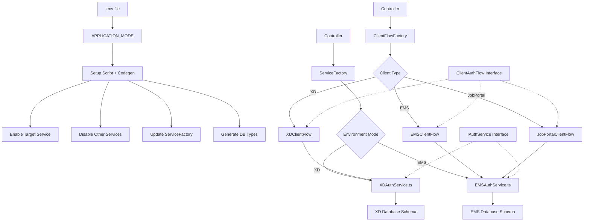
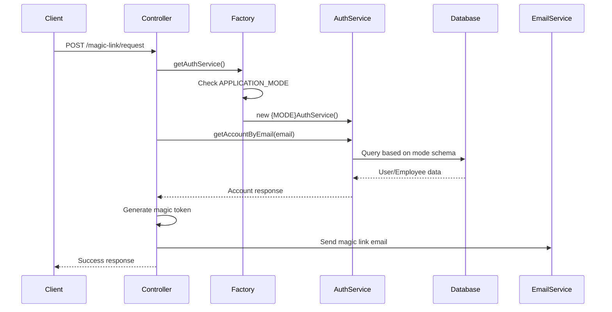
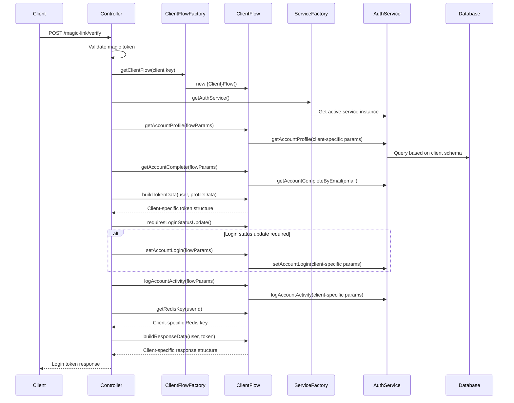

# Magic Link Service - Flow Design Documentation

## Overview / Gambaran Umum

This document explains the architecture and flow design of the Magic Link authentication service, which supports multiple applications (XD, EMS) with different databases and schemas through an environment-based build system.

Dokumen ini menjelaskan arsitektur dan desain alur dari layanan autentikasi Magic Link, yang mendukung beberapa aplikasi (XD, EMS) dengan database dan skema yang berbeda melalui sistem build berbasis environment.

---

## 🚀 Quick Start / Panduan Cepat

### For XD Development / Untuk Pengembangan XD:

```bash
# 1. Set environment mode
# Edit .env: APPLICATION_MODE="XD"

# 2. Setup build environment
pnpm run setup

# 3. Build project
pnpm build
```

### For EMS Development / Untuk Pengembangan EMS:

```bash
# 1. Set environment mode and database
# Edit .env: APPLICATION_MODE="EMS"
# (Reference .env.ems for EMS database configuration)

# 2. Setup build environment
pnpm run setup

# 3. Build project
pnpm build
```

#### Quick Build Commands / Perintah Build Cepat:

```bash
pnpm run build:setup    # Setup + Build in one command
```

---

## Architecture Pattern / Pola Arsitektur

**Hybrid Pattern:** Environment-Based Service Factory + Client Flow Strategy  
**Pola Hybrid:** Service Factory Berbasis Environment + Strategi Client Flow



**English:**  
This hybrid architecture combines environment-based build system with client flow strategy pattern, providing a clean, type-safe, and scalable approach to supporting multiple applications with different database schemas and client-specific logic in a single codebase. All client flows are consolidated in `config/client.ts` for centralized management.

**Indonesian:**  
Arsitektur hybrid ini menggabungkan sistem build berbasis environment dengan pola strategi client flow, menyediakan pendekatan yang bersih, type-safe, dan scalable untuk mendukung beberapa aplikasi dengan skema database dan logic spesifik client yang berbeda dalam satu codebase. Semua client flow dikonsolidasikan di `config/client.ts` untuk manajemen terpusat.

---

## Client Flow Strategy Pattern / Pola Strategi Client Flow

### Centralized Client Configuration / Konfigurasi Client Terpusat

#### File Structure / Struktur File:

```
src/
├── config/
│   └── client.ts            # 🗂️ ALL client flows in one centralized file
├── type/
│   ├── client.ts            # Client enum & interfaces + ClientFlow interfaces
│   ├── email.ts             # Email related types
│   ├── general.ts           # General API types
│   └── authService.ts       # Auth service interfaces
├── utils/
│   └── client.ts            # Client ID mappings
├── controller/
│   └── magicLink.ts         # Clean controller using strategy pattern
└── service/                 # Environment-based auth services
    ├── ServiceFactory.ts    # Dynamic service factory
    └── implementations/
        ├── XDAuthService.ts.disabled (or .ts if XD mode)
        └── EMSAuthService.ts (or .disabled if XD mode)
```

---

### Client Flow Abstraction / Abstraksi Client Flow

#### **Before (Controller with Conditionals) / Sebelum:**

```typescript
// ❌ Controller penuh dengan conditional logic
const profileData = await authService.getAccountProfile(
  client?.key === Client.XD ? { user_id: user.id } : { employee_id: user.id },
);

const dataToken = {
  id: user.id,
  email: user.email,
  [client?.key === Client.XD ? 'user_access' : 'profile']: profileData.data,
};

const redisKey = client?.key === Client.XD ? `user-${resUser.id}` : `employee-${resUser.id}`;
```

#### **After (Clean Strategy Pattern) / Setelah:**

```typescript
// ✅ Clean, abstracted through client flow strategy
import { clientFlowFactory } from '../config/client';
import { getActualClient } from '../utils/client';

const clientFlow = clientFlowFactory.getClientFlow(client.key);
const flowParams = { user, authService, email, userAgent, ipAddress };

const profileData = await clientFlow.getAccountProfile(flowParams);
const dataToken = clientFlow.buildTokenData(user, profileData);
const redisKey = clientFlow.getRedisKey(resUser.id);
```

---

## Build System Workflow / Alur Sistem Build

### 1. Environment Configuration / Konfigurasi Environment

English: Developers manually configure the .env file to specify which application mode to use.

Indonesian: Developer secara manual mengkonfigurasi file .env untuk menentukan mode aplikasi yang akan digunakan.

```env
# For XD Mode
APPLICATION_MODE="XD"
DATABASE_URL=postgresql://xd_database_connection

# For EMS Mode
APPLICATION_MODE="EMS"
DATABASE_URL=postgresql://ems_database_connection
```

### 2. Setup Script Execution / Eksekusi Script Setup

File: `scripts/setup-build-env.js`

**What the script does / Yang dilakukan script:**

- 🔧 Generate database types: `pnpm codegen`
- ✅ Enable target service: `{MODE}AuthService.ts`
- 🚫 Disable other services: `{OTHER}AuthService.ts.disabled`
- 🏭 Update ServiceFactory: Configure untuk mode yang aktif
- 📋 Generate summary: Show current configuration

### 3. Build-Time Type Safety / Type Safety Saat Build

TypeScript compilation ensures that only the correct database schema types are used for the active mode.

```typescript
// XD Mode - Works ✅
db.selectFrom('xd.user');

// EMS Mode - TypeScript Error ❌ (when XD schema is active)
db.selectFrom('ems.employee'); // Type error: table doesn't exist
```

---

## Core Components / Komponen Inti

### 1. Client Flow Interface / Interface Client Flow

File: `src/type/client.ts`

```typescript
export interface ClientFlowParams {
  user: any;
  authService: IAuthService;
  email: string;
  userAgent?: string;
  ipAddress?: string;
}

export interface ClientAuthFlow {
  getAccountProfile(params: ClientFlowParams): Promise<API_Response>;
  setAccountLogin(params: ClientFlowParams): Promise<API_Response>;
  logAccountActivity(params: ClientFlowParams): Promise<any>;
  getAccountComplete(params: ClientFlowParams): Promise<API_Response>;
  buildTokenData(user: any, profileData: any): Record<string, any>;
  buildResponseData(user: any, token: string): Record<string, any>;
  getRedisKey(userId: number): string;
  requiresLoginStatusUpdate(): boolean;
}
```

> This interface ensures all client flows implement the same methods, providing consistency while allowing client-specific implementations.

---

#### Key Architectural Decision: Single File Consolidation

- **English:** All client flow implementations are consolidated into a single file (`src/config/client.ts`) instead of separate files per client, and all interfaces are consolidated into `src/type/client.ts`. This eliminates folder structure complexity and the "tumpang tindih" (overlapping) issues that occurred with multiple folders.
- **Indonesian:** Semua implementasi client flow dikonsolidasikan ke dalam satu file (`src/config/client.ts`) alih-alih file terpisah per client, dan semua interface dikonsolidasikan ke dalam `src/type/client.ts`. Ini menghilangkan kompleksitas struktur folder dan masalah "tumpang tindih" yang terjadi dengan multiple folder.

#### Benefits of Single-File Approach / Manfaat Pendekatan Single-File:

- ✅ No overlapping concerns / Tidak ada tumpang tindih
- ✅ Centralized management / Manajemen terpusat
- ✅ Easier maintenance / Maintenance lebih mudah
- ✅ Clear import paths / Import path yang jelas
- ✅ Single source of truth / Single source of truth
- ✅ Consolidated interfaces / Interface terpusat di satu file
- ✅ Reduced file sprawl / Mengurangi penyebaran file

---

### 2. Client Flow Factory / Factory Client Flow

File: `src/config/client.ts`

```typescript
export class ClientFlowFactory {
  private static instance: ClientFlowFactory;

  private constructor() {}

  public static getInstance(): ClientFlowFactory {
    if (!ClientFlowFactory.instance) {
      ClientFlowFactory.instance = new ClientFlowFactory();
    }
    return ClientFlowFactory.instance;
  }

  public getClientFlow(clientKey: Client): ClientAuthFlow {
    switch (clientKey) {
      case Client.XD:
        return new XDClientFlow();
      case Client.Employee:
        return new EMSClientFlow();
      case Client.JobPortal:
        return new JobPortalClientFlow();
      default:
        throw new Error(`Unsupported client: ${clientKey}`);
    }
  }
}

// Export singleton instance
export const clientFlowFactory = ClientFlowFactory.getInstance();
```

> The factory instantiates the appropriate client flow based on the client type, centralizing client-specific logic selection.

---

### 3. Auth Service Interface / Interface Auth Service

File: `src/type/authService.ts`

```typescript
export interface IAuthService {
  getAccountByEmail(email: string): Promise<API_Response>;
  getAccountCompleteByEmail(email: string): Promise<API_Response>;
  getAccountProfile(params: { user_id?: number; employee_id?: number }): Promise<API_Response>;
  setAccountLogin(params: { user_id?: number; employee_id?: number }): Promise<API_Response>;
  logAccountActivity(params: {
    user_id?: number;
    employee_id?: number;
    user_agent?: string;
    login_use?: string;
    ip_address?: string;
  }): Promise<any>;
}
```

> This interface ensures all authentication services implement the same methods, providing consistency across different database schemas.

---

### 4. Auth Service Factory / Factory Auth Service

File: `src/service/ServiceFactory.ts`

```typescript
export class ServiceFactory {
  private static instance: ServiceFactory;
  private authService: IAuthService | null = null;

  private constructor() {}

  public static getInstance(): ServiceFactory {
    if (!ServiceFactory.instance) {
      ServiceFactory.instance = new ServiceFactory();
    }
    return ServiceFactory.instance;
  }

  public async getAuthService(): Promise<IAuthService> {
    if (!this.authService) {
      // Load service based on APPLICATION_MODE (build-time configured)
      const mode = process.env.APPLICATION_MODE || 'EMS';

      if (mode === 'EMS') {
        const { EMSAuthService } = await import('./implementations/EMSAuthService');
        this.authService = new EMSAuthService();
      } else if (mode === 'XD') {
        const { XDAuthService } = await import('./implementations/XDAuthService');
        this.authService = new XDAuthService();
      } else {
        throw new Error(`This build only supports APPLICATION_MODE=${mode}. Current mode: ${mode}`);
      }
    }

    return this.authService;
  }
}

// Export singleton instance
export const serviceFactory = ServiceFactory.getInstance();
```

> The factory uses dynamic imports to load only the required service implementation, avoiding compilation dependencies.

---

## Service Implementations / Implementasi Layanan

### XD Service Implementation

File: `src/service/implementations/XDAuthService.ts`

```typescript
export class XDAuthService implements IAuthService {
  async getAccountByEmail(email: string): Promise<API_Response> {
    const user = await db
      .selectFrom('xd.user as user')
      .where('user.email', '=', email)
      .select(['user.id', 'user.email', 'user.name'])
      .executeTakeFirst();
    return { data: user };
  }
  // ... other XD-specific implementations
}
```

### EMS Service Implementation

File: `src/service/implementations/EMSAuthService.ts`

```typescript
export class EMSAuthService implements IAuthService {
  async getAccountByEmail(email: string): Promise<API_Response> {
    const employee = await db
      .selectFrom('ems.employee as employee')
      .where('employee.email', '=', email)
      .select(['employee.id', 'employee.email'])
      .executeTakeFirst();
    return { data: employee };
  }
  // ... other EMS-specific implementations
}
```

---

## Implementation Flow / Alur Implementasi

### Magic Link Request Flow / Alur Permintaan Magic Link



### Magic Link Verification Flow / Alur Verifikasi Magic Link



---

## Client Flow Implementations / Implementasi Client Flow

### XD Client Flow

File: `src/config/client.ts` (XDClientFlow class)

```typescript
class XDClientFlow implements ClientAuthFlow {
  async getAccountProfile(params: ClientFlowParams): Promise<API_Response> {
    return await params.authService.getAccountProfile({ user_id: params.user.id });
  }

  async setAccountLogin(params: ClientFlowParams): Promise<API_Response> {
    return await params.authService.setAccountLogin({ user_id: params.user.id });
  }

  async logAccountActivity(params: ClientFlowParams): Promise<any> {
    return await params.authService.logAccountActivity({
      user_id: params.user.id,
      user_agent: params.userAgent,
      login_use: 'Magic Link',
      ip_address: params.ipAddress,
    });
  }

  buildTokenData(user: any, profileData: any): Record<string, any> {
    return {
      id: user.id,
      email: user.email,
      user_access: profileData.data, // XD uses 'user_access'
    };
  }

  buildResponseData(user: any, token: string): Record<string, any> {
    return {
      magic_link: {
        token,
        message: 'Success',
        user: user, // XD returns 'user' property
      },
    };
  }

  getRedisKey(userId: number): string {
    return `user-${userId}`; // XD prefix
  }

  requiresLoginStatusUpdate(): boolean {
    return true; // XD requires login status update
  }
}
```

### EMS Client Flow

File: `src/config/client.ts` (EMSClientFlow class)

```typescript
class EMSClientFlow implements ClientAuthFlow {
  async getAccountProfile(params: ClientFlowParams): Promise<API_Response> {
    return await params.authService.getAccountProfile({ employee_id: params.user.id });
  }

  async setAccountLogin(params: ClientFlowParams): Promise<API_Response> {
    return await params.authService.setAccountLogin({ employee_id: params.user.id });
  }

  async logAccountActivity(params: ClientFlowParams): Promise<any> {
    return await params.authService.logAccountActivity({
      employee_id: params.user.id,
      user_agent: params.userAgent,
      login_use: 'Magic Link',
      ip_address: params.ipAddress,
    });
  }

  buildTokenData(user: any, profileData: any): Record<string, any> {
    return {
      id: user.id,
      email: user.email,
      profile: profileData.data, // EMS uses 'profile'
    };
  }

  buildResponseData(user: any, token: string): Record<string, any> {
    return {
      magic_link: {
        token,
        message: 'Success',
        employee: user, // EMS returns 'employee' property
      },
    };
  }

  getRedisKey(userId: number): string {
    return `employee-${userId}`; // EMS prefix
  }

  requiresLoginStatusUpdate(): boolean {
    return true; // EMS requires login status update
  }
}
```

### JobPortal Client Flow

File: `src/config/client.ts` (JobPortalClientFlow class)

```typescript
class JobPortalClientFlow implements ClientAuthFlow {
  async getAccountProfile(params: ClientFlowParams): Promise<API_Response> {
    // JobPortal has simpler profile requirements
    return { data: null };
  }

  async setAccountLogin(params: ClientFlowParams): Promise<API_Response> {
    return await params.authService.setAccountLogin({ employee_id: params.user.id });
  }

  async logAccountActivity(params: ClientFlowParams): Promise<any> {
    return await params.authService.logAccountActivity({
      employee_id: params.user.id,
      user_agent: params.userAgent,
      login_use: 'Magic Link',
      ip_address: params.ipAddress,
    });
  }

  buildTokenData(user: any, profileData: any): Record<string, any> {
    return {
      id: user.id,
      email: user.email,
      // JobPortal doesn't need profile data in token
    };
  }

  buildResponseData(user: any, token: string): Record<string, any> {
    return {
      magic_link: {
        token,
        message: 'Success',
        employee: user, // JobPortal still uses employee data
      },
    };
  }

  getRedisKey(userId: number): string {
    return `jobportal-${userId}`; // JobPortal prefix
  }

  requiresLoginStatusUpdate(): boolean {
    return false; // JobPortal doesn't require login status update
  }
}
```

---

## Environment Management / Manajemen Environment

### File Structure After Setup / Struktur File Setelah Setup

**XD Mode Active:**

```
src/service/implementations/
├── XDAuthService.ts           # ✅ Active
├── EMSAuthService.ts.disabled # 🚫 Disabled
└── ServiceFactory.ts          # Configured for XD
```

**EMS Mode Active:**

```
src/service/implementations/
├── XDAuthService.ts.disabled  # 🚫 Disabled
├── EMSAuthService.ts          # ✅ Active
└── ServiceFactory.ts          # Configured for EMS
```

---

## Database Schema Mapping / Pemetaan Skema Database

**XD Schema:**

- Tables: `xd.user`, `xd.user_access`
- Primary Key: `user.id`
- Email field: `user.email`

Usage in code:

```typescript
// XDAuthService uses user_id parameter
{
  user_id: 123;
}
```

**EMS Schema:**

- Tables: `ems.employee`, `ems.contract`, `ems.civil_status`
- Primary Key: `employee.id`
- Email field: `employee.email`

Usage in code:

```typescript
// EMSAuthService uses employee_id parameter
{
  employee_id: 456;
}
```

---

## Available Commands / Perintah yang Tersedia

### Setup Commands / Perintah Setup

```bash
# Setup environment (auto-run codegen + read APPLICATION_MODE from .env)
pnpm run setup

# Setup + Build in one command
pnpm run build:setup

# Generate database types only
pnpm codegen

# Build only
pnpm build
```

### Mode Switching / Perpindahan Mode

```bash
# 1. Edit .env file
APPLICATION_MODE="EMS"  # Change to desired mode

# 2. Run setup
pnpm run setup

# 3. Build project
pnpm build
```

---

## Adding New Application Support / Menambahkan Dukungan Aplikasi Baru

### **Step 1: Create Service Implementation / Langkah 1: Buat Implementasi Layanan**

```typescript
// src/service/implementations/NewAppAuthService.ts
export class NewAppAuthService implements IAuthService {
  async getAccountByEmail(email: string): Promise<API_Response> {
    // Implement with your database schema
    const account = await db
      .selectFrom('your_schema.account_table')
      .where('email', '=', email)
      .select(['id', 'email'])
      .executeTakeFirst();
    return { data: account };
  }
  // ... implement other methods
}
```

### **Step 2: Update Setup Script / Langkah 2: Update Script Setup**

```js
// scripts/setup-build-env.js
const availableServices = ['XD', 'EMS', 'NEWAPP']; // Add your new service
```

### **Step 3: Environment Setup / Langkah 3: Setup Environment**

```env
# .env
APPLICATION_MODE="NEWAPP"
DATABASE_URL=postgresql://newapp_connection
```

### **Step 4: Generate Types / Langkah 4: Generate Types**

```bash
# Generate database types for your schema
pnpm generate:types

# Setup environment
pnpm run setup

# Build project
pnpm build
```

---

## Development Guidelines / Panduan Pengembangan

1. **Interface First Approach / Pendekatan Interface First**  
   Always define the interface contract first before implementing specific services.  
   Selalu definisikan kontrak interface terlebih dahulu sebelum mengimplementasikan layanan spesifik.

2. **Environment-Based Development / Pengembangan Berbasis Environment**  
   Use APPLICATION_MODE environment variable to switch between different implementations.  
   Gunakan variabel environment APPLICATION_MODE untuk beralih antara implementasi yang berbeda.

3. **Build-Time Safety / Keamanan Build-Time**  
   The system prevents runtime errors by catching schema mismatches at compile time.  
   Sistem mencegah error runtime dengan menangkap ketidakcocokan skema pada saat compile time.

4. **Manual Configuration / Konfigurasi Manual**  
   Developers manually configure .env files for maximum flexibility.  
   Developer secara manual mengkonfigurasi file .env untuk fleksibilitas maksimum.

---

## Testing Strategy / Strategi Testing

### Unit Testing / Unit Testing

```typescript
// Mock the service factory for testing
jest.mock('../service/ServiceFactory');

describe('Magic Link Controller', () => {
  it('should handle XD authentication', async () => {
    const mockAuthService = {
      getAccountByEmail: jest.fn().mockResolvedValue({
        data: { id: 1, email: 'test@example.com' },
      }),
    };
    ServiceFactory.prototype.getAuthService.mockResolvedValue(mockAuthService);
    // ... test implementation
  });
});
```

### Integration Testing / Integration Testing

Test with actual database connections using test databases for each environment.

```bash
# Test XD mode
APPLICATION_MODE="XD" npm test

# Test EMS mode
APPLICATION_MODE="EMS" npm test
```

---

## Deployment Considerations / Pertimbangan Deployment

### Build-Time Optimization / Optimasi Build-Time

Different builds can exclude unused service implementations to reduce bundle size.

### Environment-Specific Builds / Build Spesifik Environment

```bash
# Production XD Build
APPLICATION_MODE="XD" pnpm run build:setup

# Production EMS Build
APPLICATION_MODE="EMS" pnpm run build:setup
```

### Configuration Management / Manajemen Konfigurasi

```env
# Production XD
APPLICATION_MODE="XD"
DATABASE_URL=postgresql://xd_prod_db

# Production EMS
APPLICATION_MODE="EMS"
DATABASE_URL=postgresql://ems_prod_db
```

---

## Troubleshooting / Pemecahan Masalah

### Common Issues / Masalah Umum

1. **Service Not Found / Layanan Tidak Ditemukan**

   ```
   Error: This build only supports APPLICATION_MODE=XD. Current mode: EMS
   ```

   **Solution / Solusi:**
   - Check APPLICATION_MODE in .env file
   - Run `pnpm run setup` to configure environment
   - Verify service files exist in src/service/implementations/

2. **Database Schema Mismatch / Ketidakcocokan Skema Database**

   ```
   TypeError: Cannot select from 'ems.employee' - table doesn't exist
   ```

   **Solution / Solusi:**
   - Verify database schema matches the active APPLICATION_MODE
   - Generate correct database types: `pnpm generate:types`
   - Ensure database connection uses correct schema

3. **TypeScript Compilation Errors / Error Kompilasi TypeScript**

   ```
   Property 'ems' does not exist on type 'Database'
   ```

   **Solution / Solusi:**
   - Regenerate database types for your schema
   - Check if database types include the required tables
   - Verify APPLICATION_MODE matches your database schema

4. **Setup Script Issues / Masalah Script Setup**

   ```
   No changes to the environment were made. Everything is already up to date.
   ```

   **Solution / Solusi:**
   - Use `pnpm run setup` instead of `pnpm setup`
   - Clear pnpm cache: `pnpm store prune`
   - Run setup script directly: `node scripts/setup-build-env.js`

---

## Future Enhancements / Peningkatan Masa Depan

- **Automatic Type Generation:** Auto-generate database types based on APPLICATION_MODE
- **Service Health Checks:** Health monitoring for each service implementation
- **Multi-Schema Support:** Support for multiple database schemas in single mode
- **Configuration Validation:** Validate environment configuration before build
- **Hot Reloading:** Development mode with automatic service switching

---

## Contributing / Kontribusi

**When adding new service implementations, follow the established patterns and ensure proper documentation.**

### Contribution Checklist / Checklist Kontribusi:

- ✅ Define interface contract first / Definisikan kontrak interface terlebih dahulu
- ✅ Implement service class / Implementasikan kelas layanan
- ✅ Update setup script / Update script setup
- ✅ Add to availableServices array / Tambahkan ke array availableServices
- ✅ Create example .env file / Buat contoh file .env
- ✅ Add tests / Tambahkan test
- ✅ Update documentation / Update dokumentasi
- ✅ Test build process / Test proses build

---

## Summary / Ringkasan

This hybrid architecture combines environment-based build system with client flow strategy pattern, providing a clean, type-safe, and scalable approach to supporting multiple applications with different database schemas and client-specific logic in a single codebase.

Arsitektur hybrid ini menggabungkan sistem build berbasis environment dengan pola strategi client flow, menyediakan pendekatan yang bersih, type-safe, dan scalable untuk mendukung beberapa aplikasi dengan skema database dan logic spesifik client yang berbeda dalam satu codebase.

### Key Benefits / Manfaat Utama:

- 🔒 Type Safety: Compile-time schema validation + client interface contracts
- 🚀 Performance: Only required services loaded + client-specific optimizations
- 🛠️ Maintainability: Clean separation of concerns at both service and client levels
- 📈 Scalability: Easy to add new applications and client types
- 🧩 Error Prevention: No cross-dependencies + no client conditionals
- 🎯 Developer Experience: Auto-codegen + centralized client config
- 🏆 Dual Abstraction: Environment-based services + Client-based flows
- ✨ Clean Controller: No conditional logic, pure orchestration
- 📁 Centralized Client Logic: All client flows in single config file
- 🚫 No Overlapping Structure: Eliminates folder complexity

### Architecture Layers / Layer Arsitektur:

- 🏭 Environment Layer / Layer Environment: Service selection based on APPLICATION_MODE
- 🎯 Client Layer / Layer Client: Flow selection based on client type
- 🗄️ Data Layer / Layer Data: Auto-generated types with schema validation
- 🔌 Interface Layer / Layer Interface: Contracts ensuring consistency

> The system successfully eliminates the complexity of managing multiple authentication services AND client-specific logic while maintaining clean architecture, type safety, and centralized configuration!  
> All client flows are consolidated in a single `config/client.ts` file, solving the "tumpang tindih" (overlapping) folder structure issues. 🎉
